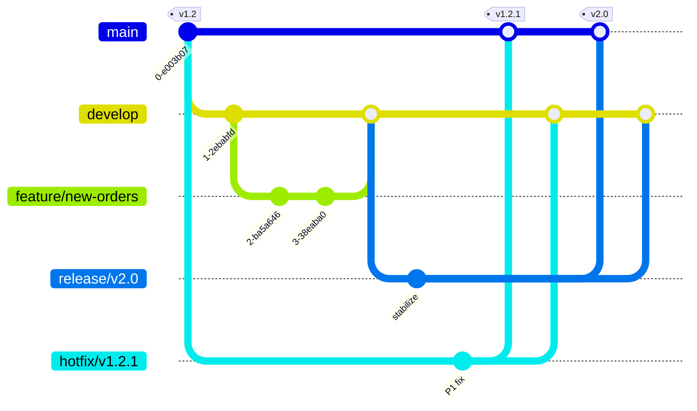
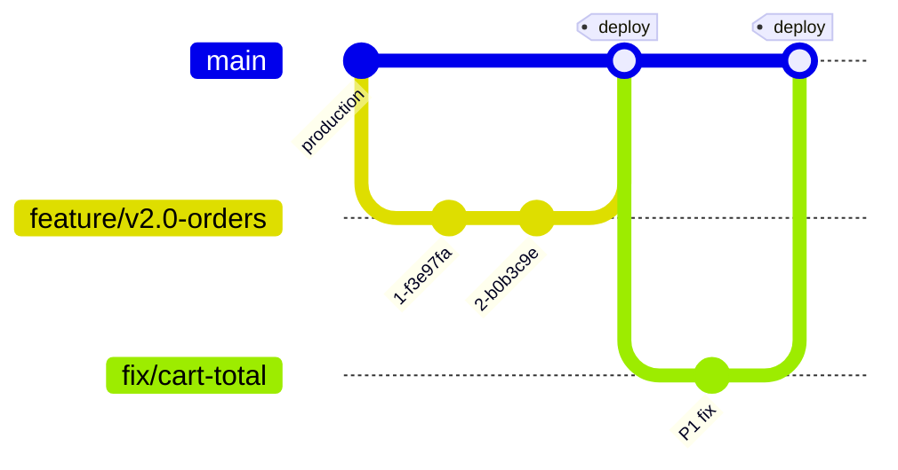
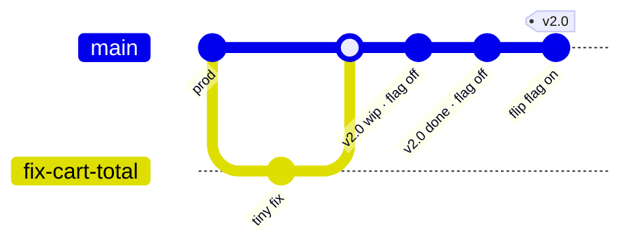

# Branching strategies — cheat sheet

Reference reading for the branching part of the lab. Three strategies, the same release scenario applied to each, and a decision matrix at the end.

## The scenario

> Your team is shipping v2.0 of the product next week. Mid-week, a customer reports a P1 bug in v1.2 that's already in production. You need to ship the v1.2 hotfix today AND keep v2.0 on track.

We'll see how each strategy handles this.

## Git Flow

Two long-lived branches (`main` and `develop`) plus three types of short-lived branches (`feature/*`, `release/*`, `hotfix/*`).

Notice how the hotfix and the release move in parallel: `hotfix/v1.2.1` ships from
`main` while `release/v2.0` stabilizes off `develop`, and each merges back into
*both* long-lived branches. That double-merge is the price of admission for
maintaining multiple versions at once.

**Branches in flight at scenario time:**
- `develop` — where v2.0 work happens
- `release/v2.0` — branched off `develop`; final stabilization
- `hotfix/v1.2.1` — branched off `main` (which is at v1.2); merges to *both* `main` and `develop` when done

**Pros:** Explicit release branches make multi-version maintenance easy. Strong conventions help large teams.

**Cons:** A *lot* of moving branches. Merge conflicts between `develop`, `release/*`, and `main` are constant. Considered over-engineered by most modern teams.

**Fits when:** You ship versioned releases (v1.x, v2.x) that you actively maintain in parallel. Common in shrink-wrap software, embedded systems, and some on-prem enterprise products.

## GitHub Flow

One long-lived branch: `main`. Everything else is a short-lived `feature/*` branch that gets merged via PR.

One line, always deployable. Every change is a short branch that comes back
through a PR, and merging *is* the release (`deploy`). Clean — until you need to
keep an old version alive, which is the next question.

**Branches in flight at scenario time:**
- `main` — *is* what's in production
- `feature/v2.0-something` — work for v2.0
- `feature/fix-v1.2-bug` — but wait, what's v1.2?

**Where v1.2 lives is the question.** GitHub Flow assumes "what's on `main` is what's deployed." If you need to maintain v1.2 in production while also developing v2.0, GitHub Flow alone doesn't really have an answer — you typically pair it with deploy tags (`production-v1.2`) and never actually move `main` to "v2.0" until you cut over.

**Pros:** Simple. Easy to teach. Aligns naturally with continuous deployment.

**Cons:** Assumes one deployable artifact at a time. Awkward when you ship versioned products to multiple customers.

**Fits when:** You deploy `main` continuously to a single environment. SaaS teams, internal tools, single-tenant apps.

## Trunk-based development

Everyone commits directly to `main` (the "trunk"). Branches are short — hours, not days. Feature flags hide in-progress work in production until it's ready.

There's almost no branching to see — that's the point. The v1.2 fix is a branch
that lives for an hour; the v2.0 work lands directly on `main` behind a flag
that's off in production, and the "release" is just flipping that flag on. No
long-lived branches, no double-merges.

**Branches in flight at scenario time:**
- `main` — production. Always.
- `fix-v1.2-bug-cyx7` — branched off `main` an hour ago; will merge in another hour.
- v2.0 work: not on a branch. It's *behind a feature flag* in `main`, off by default in production.

**Pros:** Tiny diffs are easy to review. Continuous integration is much easier. No long-lived merge pain.

**Cons:** Requires a feature-flag system (homegrown or hosted — LaunchDarkly, GrowthBook, Unleash, etc.). Requires very high CI/test discipline. Hard if your product can't tolerate dead code behind flags.

**Fits when:** You have a small, high-trust team; CI/test discipline; and a feature-flag system. Often the explicit goal of a team migrating from Git Flow.

## Decision matrix

Pick the row that matches your team most closely:

| Your situation | Best fit |
|---|---|
| Single SaaS product, continuous deploy, 2–10 engineers | **GitHub Flow** |
| Multiple supported versions in production at the same time | **Git Flow** (or GitHub Flow + tags) |
| Strict regulatory environment, lengthy validation per release | **Git Flow** (release branches make audit easy) |
| Mature team with feature flags and full CI | **Trunk-based** |
| Brand-new team, learning Git for the first time | **GitHub Flow** (lowest cognitive overhead) |
| Embedded firmware, infrequent releases, long maintenance tails | **Git Flow** |
| Ignition team shipping to multiple customer gateways | **GitHub Flow + tags per customer** (we cover this in Lab 05) |

## What this masterclass uses

This masterclass uses **GitHub Flow** for the cohort playground repo, because it's simple to teach and aligns with the labs' single-environment dev stack. We discuss trunk-based development in Day 2 when we get into CI quality gates.

For *your team*, pick the one that fits your reality — not the one that sounds most sophisticated.
